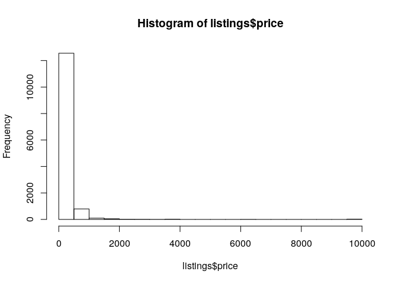
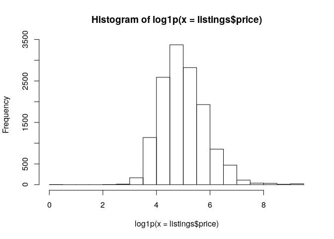
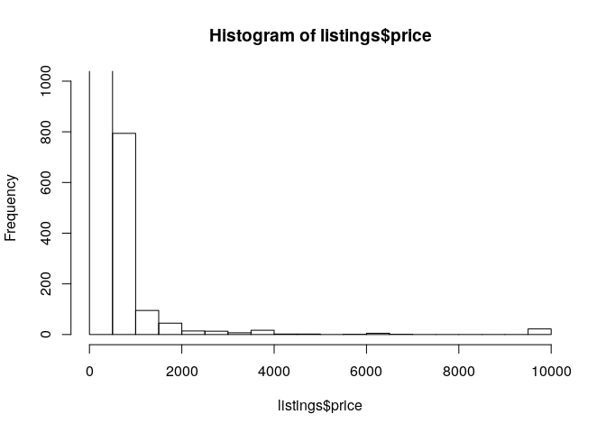
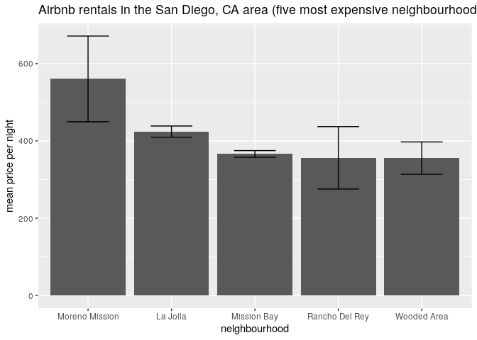

Airbnb listings in San Diego, CA, USA
================

##### data frame: structure

    ## 'data.frame':    13574 obs. of  16 variables:
    ##  $ id                            : int  5570 8488 29967 38245 39516 52286 54001 62274 62949 67441 ...
    ##  $ name                          : chr  "Ocean front condo on the sand" "Juniper Zen Palace- SD's Best Hood!" "Great home, 10 min walk to Beach" "Point Loma/Liberty Station-NTC" ...
    ##  $ host_id                       : int  8435 25186 129123 164137 169649 215810 252692 302986 21532 332552 ...
    ##  $ host_name                     : chr  "Jef Karchin" "Helene" "Michael" "Melinda" ...
    ##  $ neighbourhood_group           : logi  NA NA NA NA NA NA ...
    ##  $ neighbourhood                 : chr  "Mission Bay" "South Park" "Pacific Beach" "Roseville" ...
    ##  $ latitude                      : num  32.8 32.7 32.8 32.7 32.7 ...
    ##  $ longitude                     : num  -117 -117 -117 -117 -117 ...
    ##  $ room_type                     : chr  "Entire home/apt" "Entire home/apt" "Entire home/apt" "Private room" ...
    ##  $ price                         : int  2050 225 225 75 74 550 110 68 75 90 ...
    ##  $ minimum_nights                : int  3 3 4 1 3 7 2 2 1 3 ...
    ##  $ number_of_reviews             : int  0 40 60 143 384 0 214 538 612 3 ...
    ##  $ last_review                   : chr  "" "2016-03-24" "2018-08-09" "2019-10-20" ...
    ##  $ reviews_per_month             : num  NA 0.36 0.53 1.28 3.38 NA 1.98 4.93 6.94 0.05 ...
    ##  $ calculated_host_listings_count: int  2 2 5 3 1 1 3 2 2 5 ...
    ##  $ availability_365              : int  176 218 234 306 319 90 322 256 44 2 ...

data frame: variable
    names

    ##  [1] "id"                             "name"                          
    ##  [3] "host_id"                        "host_name"                     
    ##  [5] "neighbourhood_group"            "neighbourhood"                 
    ##  [7] "latitude"                       "longitude"                     
    ##  [9] "room_type"                      "price"                         
    ## [11] "minimum_nights"                 "number_of_reviews"             
    ## [13] "last_review"                    "reviews_per_month"             
    ## [15] "calculated_host_listings_count" "availability_365"

##### histogram: Airbnb listings price

<!-- -->

##### histogram: Airbnb listings price (ln+1 transformed)

<!-- -->

##### histogram: Airbnb listings price (ln+1 transformed), contrained y-axis

<!-- -->

##### result: table (Tibble) of neighborhoods (n = 5) with the highest average rental rates

    ## # A tibble: 5 x 5
    ##   neighbourhood  count priceMean priceSD priceSE
    ##   <chr>          <int>     <dbl>   <dbl>   <dbl>
    ## 1 Moreno Mission   124      560.   1235.  111.  
    ## 2 La Jolla         883      424.    433.   14.6 
    ## 3 Mission Bay     1637      366.    351.    8.67
    ## 4 Rancho Del Rey    11      356.    268.   80.7 
    ## 5 Wooded Area       69      355.    348.   41.9

##### result: plot of neighborhoods (n = 5) with the highest average rental rates

<!-- -->

##### Q1: did filtering the data change which neighborhoods were identified as having the highest rental rates?

YOUR RESPONSE FOR Q1 GOES HERE.

##### Q2: ultimately, did you filter the data, why or why not?

YOUR RESPONSE FOR Q2 GOES HERE.
