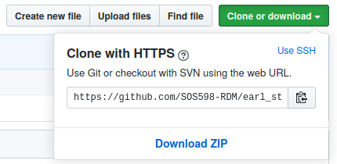
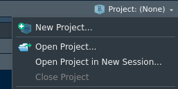
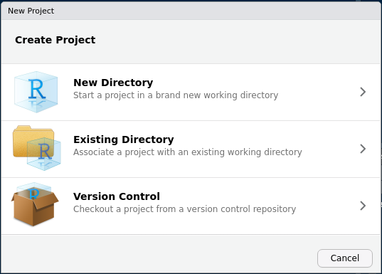
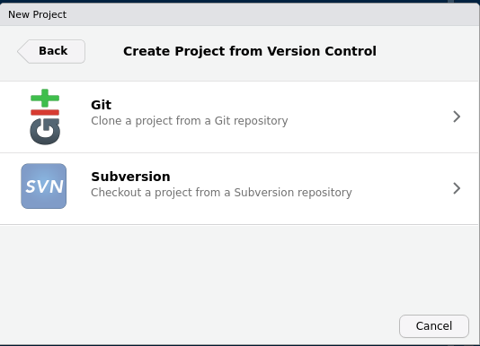
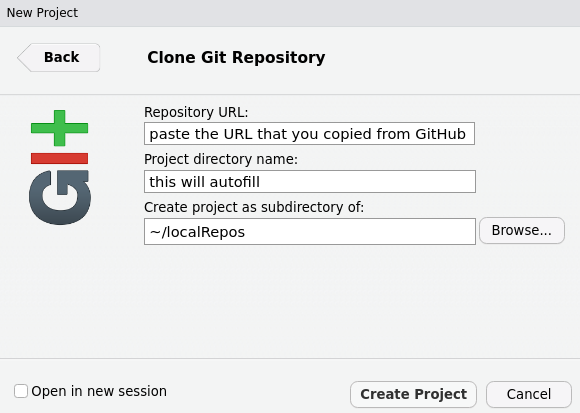
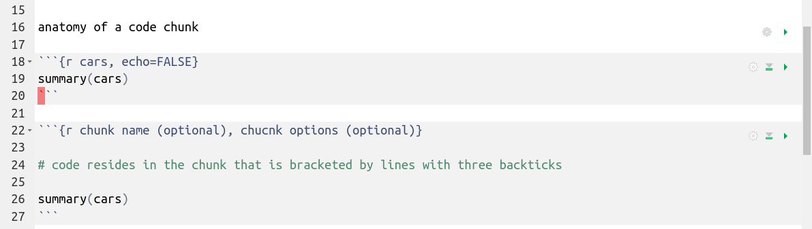

Airbnb listings in San Diego, CA, USA
================


#### attribution

  - Inspiration and baseline materials for this exercise are derived
    from the [Materials for the Designing the Data Science
    Classroom](https://rstudio-conf-2020.github.io/design-ds-classroom/)
    workshop by Mine Çetinkaya-Rundel at rstudio::conf(2020).
  - The data for this exercise are provided by
    [Airbnb](http://insideairbnb.com/get-the-data.html).

#### background

Recent developments in San Diego, CA, USA regarding the growth of Airbnb
and its impact on the housing, rental, and hospitality markets require a
better understanding of the Airbnb listings. Using data provided by
Airbnb, we can explore how Airbnb rentals vary by neighborhood among
other relationships.

#### learning goals

The goal of this exercise is not to conduct a thorough analysis of
Airbnb listings but rather to use the data to introduce the R language,
working in the RStudio environment, and accessing and managing files
with Git and GitHub.

#### getting help

If you have any questions about the exercise or assignment, please post
them as issues to the
[rdm-community](https://github.com/SOS598-RDM/rdm-community/issues)
repository on the course GitHub organization.

-----

#### getting started: clone the repository and configure Git

The next few steps will walk you through the process of cloning the
repository using RStudio.

##### 1\. obtain URL of the repository to be cloned

In GitHub, click on the green **Clone or download** button, select **Use
HTTPS** (this might already be selected by default; if so you will see
the text **Clone with HTTPS** as in the image). Click on the clipboard 📋
icon to copy the URL of the repository.



##### 2\. clone the repository to your computer using RStudio

2a. From the **Project** tab (top-right corner), create a **New
Project**



2b. Create a new project using **Version Control**



2c. Clone the project from a Git repository



2d. Provide relevant details for the project:

  - the URL that you copied from GitHub
  - the repository name is provided by default as the name of the
    project (you can edit this but it is best to use the repository name
    (default))
  - select a location (on your computer) where the repository will be
    cloned



##### 3\. configure Git

We need to configure RStudio so that it can communicate with GitHub.
This requires two pieces of information: your email address and your
name. This is a one-time operation that you should need to do only once
on any given computer.

Run the following `use_git_config` function in the console being sure to
replace `your name` and `your.email@address.com` with your information
(`your name` should be your name in the form First Last (not your GitHub
user name) and `your.email@address.com` must be the email address that
you used to establish your GitHub account):

``` r
usethis::use_git_config(user.name = "your name", 
                        user.email = "your.email@address.com")
```

If you encounter the error `Error in use_get_config() : could not find
function "use_get_config"` when running `use_git_config`, install the
usethis package by typing `install.packages("usethis")` into the R
console then rerun.

-----

#### Rmarkdown and Git/GitHub

*Rmarkdown*

R Markdown is a file format for making dynamic documents with R. An R
Markdown document is written in markdown (an easy-to-write plain text
format) and contains chunks of embedded R code
([Grolemund 2014](https://rmarkdown.rstudio.com/articles_intro.html)).



All of the code in a Rmd document can be run sequentially by knitting
the document or chunks of code can be run individually by clicking the
play button on a given chunk.

*YAML*

The top portion of a R Markdown file (between the three dashed lines) is
called YAML (Yet Another Markup Language), a reasonably friendly data
serialization standard for all programming languages. The YAML contains
meta information about the document.

``` yaml
---
title: "Airbnb listings in San Diego, CA, USA"
author: ""
date: ""
output: github_document
---
```

*Knit*

Open the R Markdown (.Rmd) file in your project then change the author
name to your name and date to today’s date. Knit the document with the
Knit button in the upper-left corner of RStudio. The libraries needed to
knit the document should come installed with RStudio but if the knit
fails, install the rmarkdown and knitr packages by typing
`install.packages("rmarkdown")` then `install.packages("knitr")` into
the console then reknit the document.

Knitting produces another document, the type of which corresponding to
the `output:` we have defined in the YAML (e.g., html, PDF), that weaves
together the text and code detailed in the .Rmd document. After
knitting, we should see changes to both the source .Rmd and resulting
output file reflected in the Git pane of Rstudio (top-right corner).

*Git Diff and Commit*

In the Git pane, click on the .Rmd or output to file select it then
click on **Diff**. This shows you the *diff*erence between the last
committed state of the document and its current state that includes your
changes. When ready, we can commit a snapshot of the project state by
staging the files we want to commit (with the stage toggle option),
adding a **Commit message** box, and pressing **Commit**.

Committing after every change is not necessary and, in fact, would
become cumbersome and result in an abundance of potentially trivial
commits. Consider committing project snapshots that are meaningful to
you for inspection, comparison, or restoration.

*pushing to GitHub*

After making a commit, we have the option to push the project at that
state to the project repository on GitHub. As with committing, you do
not need to push with every project change or with every commit. Push as
needed for appropriately backing up the project, recording significant
changes, or facilitating collaborative work among others.

In order to push your changes to GitHub, click **Push**. This will
prompt a dialogue box where you first need to enter your GitHub user
name, and your password. Jenny Bryan has well-documented instructions
for setting up Git so that you do not need to enter your name and
password for every GitHub action -
[explore](https://happygitwithr.com/push-pull-github.html#am-i-really-going-to-type-github-username-and-password-on-each-push)
these at your convenience but the user name and password approach will
work in the meantime.

-----

#### assignment

Details of a workflow nearly identical to what you will do for your
assignment are described below, but address your assignment in the
repository created for you.

*packages*

In addition to the functionality provided by base R, we will use tools
provided in a package called tidyverse. Once installed, load the package
so that its functionality is available by calling the library.

``` r
library(package = tidyverse)
```

*getting the data*

We will use data provided by
[Airbnb](http://insideairbnb.com/get-the-data.html). Here, we can use
the url function wrapped by the read.csv function to import the data
from Airbnb.

  - Note that we are not downloading the data to a file but rather
    reading them directly into our R environment. For a reproducible
    workflow, we would probably want to download and save a copy of
    these data in case they change or become unavailable but we merely
    refer to Airbnb for this one-time assignment.
  - Note the `stringsAsFactors = FALSE` argument we pass to the read.csv
    function to prevent it from converting any data columns that contain
    strings to factors.
  - Note that this URL is specific to San Diego, CA but your assignment
    will focus on a different
location

<!-- end list -->

``` r
listings <- read.csv(url('http://data.insideairbnb.com/united-states/ca/san-diego/2019-11-21/visualisations/listings.csv'),
                     stringsAsFactors = FALSE)
```

*data structure*

Once loaded, observe that an object called `listings` has been added to
your environment (in the Environment tab (top right pane of RStudio)).
Click on this object to view the data in the data viewer. Click on the
button to the left of listings in the Environment tab to view the
structure of the data. This is equivalent to calling the `str()`
function on the data as below.

``` r
str(listings)
```

Each column represents a variable. We can get a list of the variables in
the data frame using the `names()` function as below.

``` r
names(listings)
```

The data variables and their descriptions are provided below:

  - `id`: listing id
  - `review_scores_location`: 0-5 stars converted into a 0-10 scale
  - `name`: listing name
  - `host_id`: host id
  - `host_name`: host name
  - `neighbourhood_group`: ?
  - `neighbourhood`: neighbourhood
  - `latitude`: listing latitude
  - `longitude`: listing longitude
  - `room_type`: type of listing (Entire home/apt, Private room, Shared
    room)
  - `price`: listing price
  - `minimum_nights`: required minimum nights stay
  - `number_of_reviews`: total number of reviews
  - `last_review`: date of last review
  - `reviews per month`: average number of reviews per month
  - `calculated_host_listings_count`: total number of listings for this
    host
  - `availability_365`: number of days listing is available out of 365

##### project goal: identify neighbourhoods with highest rental rates

We want to identify neighborhoods with the highest rental rates. We will
start by examining the rental rates (`price`) data.

Start with a histogram of the price data using the `hist` function. Here
we call the `hist()` function on the price column of the listings object
with the notation `listings$price`.

``` r
hist(x = listings$price)
```

The histogram indicates that the price data are highly skewed. Let us
look at a histogram again but this time on price data that are log
transformed. The `log1p` function will ln + 1 transform the price data.

``` r
hist(x = log1p(x = listings$price))
```

The price data may be close to a log-normal distribution. Transforming
the data will satisfy some statistical assumptions but we need to
consider whether we want to include exceptionally high rental rates in
our assessment.

We can assess the range of the price data in finer detail by changing
the range of the y-axis of our histogram. We can address this by setting
the `ylim` argument in our histogram. Adjust the maximum y-axis value by
changing the second number in the vector that is passed to the ylim
argument.

``` r
hist(x = listings$price,
     ylim = c(0, 1000))
```

Do we want to exclude the exceptionally high rental rates from our
analyses? If so, here is how we might accomplish that.

``` r
listings <- listings %>%
  filter(price <= 4000)
```

The code above will overwrite our existing listings data frame with a
revised data frame of the same name but where records with a price \>
4000 excluded. You can adjust the threshold at which data are removed
based on the value of price by editing the value passed to filter. Note,
though, that we overwrite listings each time we run this code so you may
need to redownload the data.

Filter the data then rerun the histogram(s) on the filtered data set.

When we have a data set that we are ready to analyze, we need to
identify the neighborhoods with the highest rental rates. We can use the
code below to address this. What the code is doing at each step is
provided in comments.

``` r
listings %>% # identify that we will use the listings object
  group_by(neighbourhood) %>% # group the data around the neighborhoods
  # for each neighborhood, calculate summary statistics
  summarise(
    count = n(), # the number of listings in each neighborhood (IEN)
    priceMean = mean(price), # the mean price of listings IEN
    priceSD = sd(price), # the standard deviation of the prices IEN
    priceSE = priceSD/sqrt(count) # the standard error of the price IEN
  ) %>% # use (or pass) the new object of summary values we have just created
  top_n(n = 5, wt = priceMean) %>%  # extract five records that have the highest mean price
  arrange(desc(priceMean)) # arrange data by price (desc = highest to lowest)
```

The output of the above code is a table of five neighborhoods with the
highest rental rates. This is great but it would be helpful to visualize
the results. We can start with the same code since we will need all of
those data then pass them to a series of graphing functions. We can use
the code below to address that and, as above, comments of what is
happening at each step are provided.

``` r
listings %>% 
  group_by(neighbourhood) %>% 
  summarise(
    count = n(),
    priceMean = mean(price),
    priceSD = sd(price),
    priceSE = priceSD/sqrt(count)
  ) %>%
  top_n(n = 5, wt = priceMean) %>% 
  # mutate (change) neighbourhood to a factor so we can order it logically in our plot
  mutate(neighbourhood = fct_reorder(.f = neighbourhood, .x = priceMean, .desc = TRUE)) %>% 
  # call the ggplot function and create a blank canvas with neighbourhood and priceMean as the input data
  ggplot(aes(x = neighbourhood, y = priceMean)) +
  # add bars to reflect priceMean; stat = 'identity' tells geom_bar to make the bar heights correspond to the y variable (priceMean) that we called above
  geom_bar(stat = 'identity') +
  # add error bars based on the standard errors we calculated earlier
  geom_errorbar(aes(ymin = priceMean - priceSE, ymax = priceMean + priceSE), width = 0.5) +
  # add a descriptive title
  ggtitle(label = "Airbnb rentals in the San Diego, CA area (five most expensive neighbourhoods)") +
  # add a meaningful y-axis lable
  ylab("mean price per night")
```

-----

#### project requirements

Read the instructions for your assignment in the README of your
assignment repository. Complete your work in the R Markdown document
(Rmd) included in your assignment repository.

Before doing any work, open the Rmd and Knit it to make sure that it
compiles without errors. The output will have the same file name but the
file extension will be `.md`.

Edit the code Rmd, including whether to and at what threshold to filter
data, based on your assessment of the data. Provide answers to questions
1 and 2 based on your assessment.

Final output should be:

1.  Rmd with your final code and answers to questions 1 and 2.
2.  the knitted document (will knit to filetype md), which should
    feature the table and plot you produced documenting the five
    neighborhoods with the highest rental rates.
3.  push the finished project to your assignment repository on GitHub.
